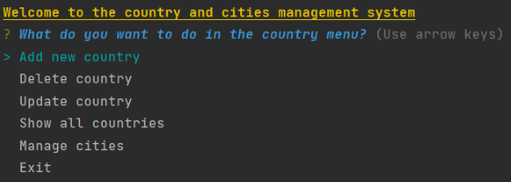
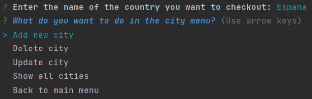

# First Bimester Exam

Write a CRUD (Create Read Update Delete) program. These operations must be carried out in both entities. The entities must have 5 data each. Among the 10 entity data there must be the following different Javascript variables (Date, Boolean, String, Number). Entities are related from ONE to MANY.
The assignment is delivered with a video (Create, Read, Update, Delete) and the code written in the course repository.

## Table of Contents

1. [Outcomes](#outcomes)
   1. [Code](#outcomes)
   2. [Video](#outcomes)

2. [Documentation](#documentation)
   1. [Run](#run)
   2. [Tech Stack](#tech)
   3. [Examples](#examples)
   4. [Authors](#authors)
   5. [License](#license)

## [Outcomes](#outcomes)

- [Código (GitHub)](https://github.com/2022B-web-avanzada-soft/santacruz-portilla-cesar-joel-web-adv/tree/main/01-bimester-exam)

- [Video (Youtube)](https://1drv.ms/b/s!Aj6AIBJZ_H9ctZkjKpWK1esHxVTDqQ?e=I3nYFW)

## [Documentation](#documentation)

### [Running Tests](#run)

To run, try the following command

```bash
  npm run start Exam
```

### [Tech Stack](#tech)

**Dependencies:** [Chalk](https://www.npmjs.com/package/chalk), [Inquirer](https://www.npmjs.com/package/inquirer), [Inquirer-date-prompt](https://www.npmjs.com/package/inquirer-date-prompt)

### [Examples](#examples)

#### Run Exam


#### City CRUD


### [Authors](#authors)

- [@cesarsant2000](https://www.github.com/octokatherine)

### [License](#license)

[MIT](https://choosealicense.com/licenses/mit/)


