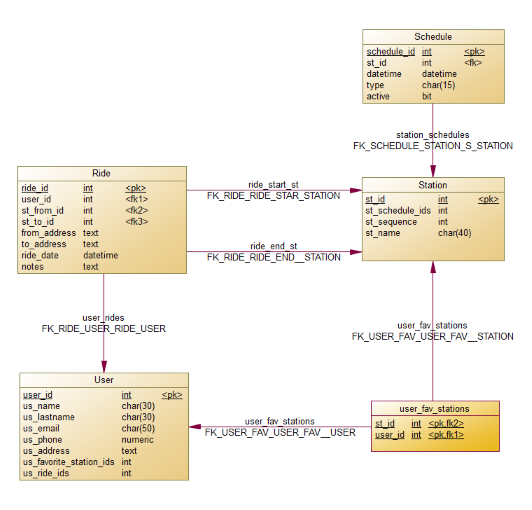

# First Bimester Project

The objective of this project is to identify the user stories, database model and prototype for the Quito Metro web application.

## Content

- [Database (SQL Server)](https://1drv.ms/u/s!Aj6AIBJZ_H9ctZkhcOYYNZ0M3ZyQnQ?e=8HP02g)

- [Prototipe (Adobe XD)](https://1drv.ms/b/s!Aj6AIBJZ_H9ctZkjKpWK1esHxVTDqQ?e=I3nYFW)

- [User Stories (PDF)](https://1drv.ms/b/s!Aj6AIBJZ_H9ctZki6aCTEOLB7izrbQ?e=VsIac3)

## DB model

## Prototype

## Authors

- [@cesarsant2000](https://www.github.com/octokatherine)

- [@Lizbeth-Santamaria](https://github.com/Lizbeth-Santamaria)

## Documentation

[SQL Server](https://www.microsoft.com/en-us/sql-server/sql-server-2022)

[Adobe XD](https://helpx.adobe.com/support/xd.html)
