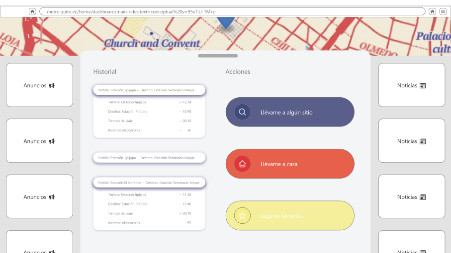

# First Bimester Project

The objective of this project is to identify the user stories, database model and prototype for the Quito Metro web application.

## Content

- [Database (SQL Server)](src/zip/1SantacruzSantamariaDB.zip)

- [Prototipe (Adobe XD)](src/pdf/2SantacruzSantamariaPrototipo.pdf)

- [User Stories (PDF)](src/pdf/3SantacruzSantamariaUH.pdf)

## DB model

## Prototype

## Authors

- [@CesarSant2000](https://github.com/CesarSant2000)

- [@Lizbeth-Santamaria](https://github.com/Lizbeth-Santamaria)

## Documentation

[SQL Server](https://www.microsoft.com/en-us/sql-server/sql-server-2022)

[Adobe XD](https://helpx.adobe.com/support/xd.html)
